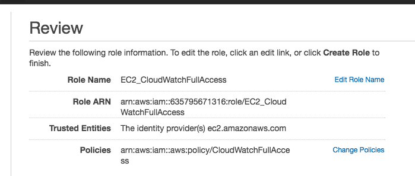
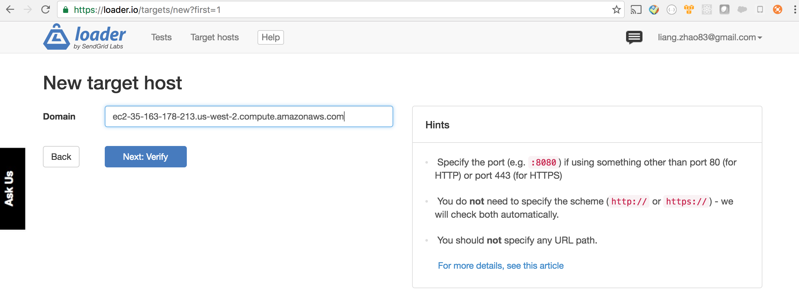
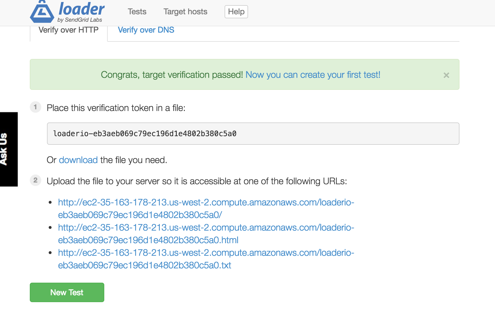

### AWS CloudWatch Demo

# express app used for testing:

A very simple express server with :
  * requests logging - it will put every request into log files (it was configured to create a new log file every minute - for testing CloudWatch's custom logs feature)
  * loader.io setup

* [morgan](https://github.com/expressjs/morgan)
* [file-stream-rotator](https://github.com/holidayextras/file-stream-rotator)
* [loader.io](https://loader.io/)

# CloudWatch
  * create a role so EC2 can access CloudWatch with it
  
  * launch an EC2 instance with
    * the newly creately role attached
    * default VPC with auto-assign public IP enabled
    * security group with SSH and HTTP enabled
  * SSH into the instance (install docker engine and docker-compose) and scp ./deploy/docker-compose.yml into it
  * run the docker image (verify loader.io)
  
  

  * Monitoring your instance's memory and disk utilization using CloudWatch script
