### AWS CloudWatch Demo

# express app used for testing:

A very simple express server with :
  * requests logging - it will put every request into log files (it was configured to create a new log file every minute - for testing CloudWatch's custom logs feature)
  * loader.io setup
  * docker-compose (prod) - mapping container's `/usr/src/app/log` folder back to AMZ Linux's `${HOME}/log`, so we can later use this folder in CloudWatch custom log setup
  ```
  express:
    image: jacky1999cn2000/aws-cloudwatch-demo:latest
    ports:
      - "80:3000"
    volumes:
      - ${HOME}/log:/usr/src/app/log
    working_dir: "/usr/src/app"
    entrypoint: "forever index.js"
  ```

* [morgan](https://github.com/expressjs/morgan)
* [file-stream-rotator](https://github.com/holidayextras/file-stream-rotator)
* [loader.io](https://loader.io/)

# CloudWatch
  * create a role so EC2 can access CloudWatch with it
  
  * launch an EC2 instance with
    * the newly creately role attached
    * default VPC with auto-assign public IP enabled
    * security group with SSH and HTTP enabled
  * SSH into the instance (install docker engine and docker-compose) and scp ./deploy/docker-compose.yml into it
  * run the docker image (verify loader.io)
  
  

  * TASK1(PREPARATION): setup instance for memory and disk utilization monitoring
    * [AWS CloudWatch Script](http://docs.aws.amazon.com/AWSEC2/latest/UserGuide/mon-scripts.html)
  * TASK2(PREPARATION): monitoring logs using CloudWatch logs
    * create a log group (in aws web console)
    * create a log stream (in aws web console)
    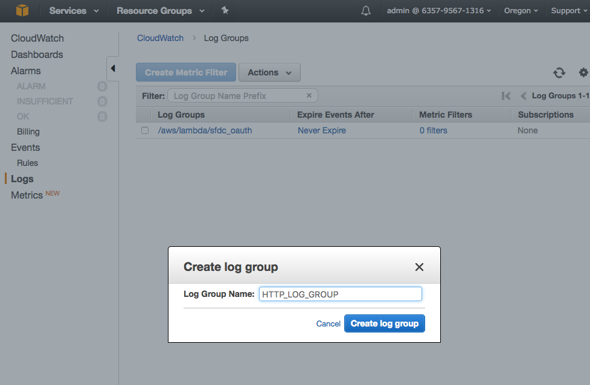
    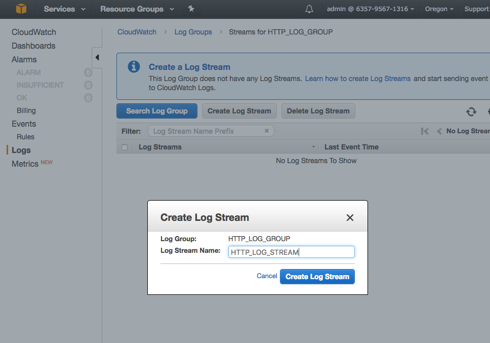
    * modify awscli.conf (in EC2 instance)
    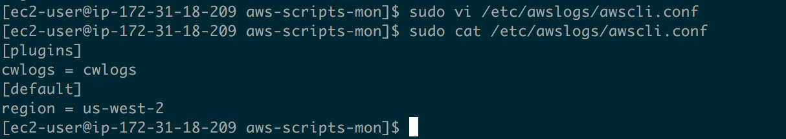
    * install log agent `sudo yum install awslogs` (in EC2 instance)
    * modify aswlog conf `sudo vi /etc/awslogs/awslogs.conf` (in EC2 instance - use "control+b" in vi to navigate to the ending of the file for modifications)
    * we have multiple log files so use `/home/ec2-user/log/access.log*`
    ```
    [/var/log/messages]
    datetime_format = %b %d %H:%M:%S
    file = /home/ec2-user/log/access.log*
    buffer_duration = 5000
    log_stream_name = HTTP_LOG_STREAM
    initial_position = start_of_file
    log_group_name = HTTP_LOG_GROUP
    ```
    * `sudo service awslogs start`
    * `sudo chkconfig awslogs on`
    * [log agent reference](http://docs.aws.amazon.com/AmazonCloudWatch/latest/logs/AgentReference.html)

  * run loader.io test
  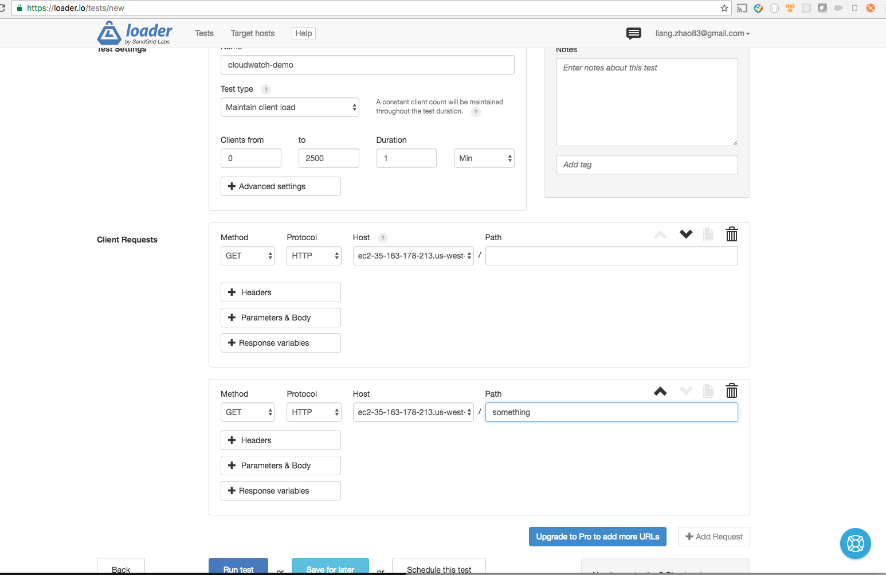
  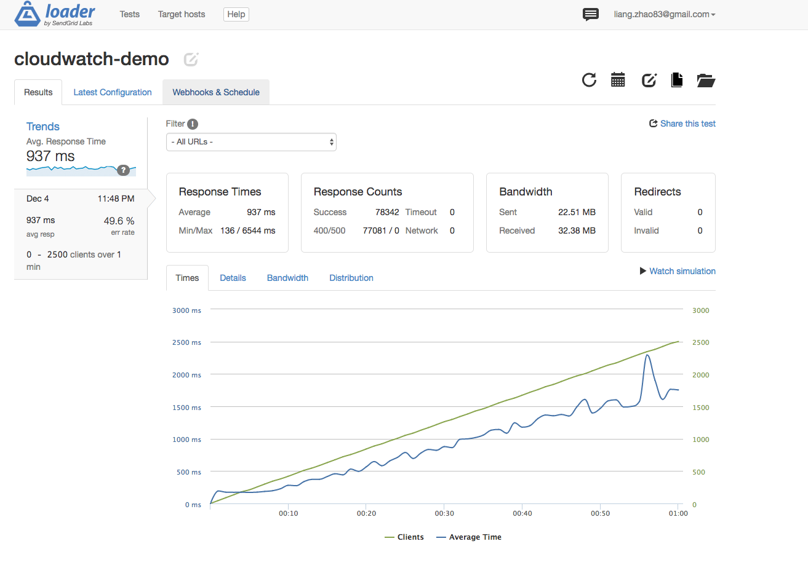

  * TASK1(RESULT)
  AWS CloudWatch script will send information to CloudWatch every 5 mins, and we can access this in CloudWatch/Metrics/Linux System, and can create a graph based on it
  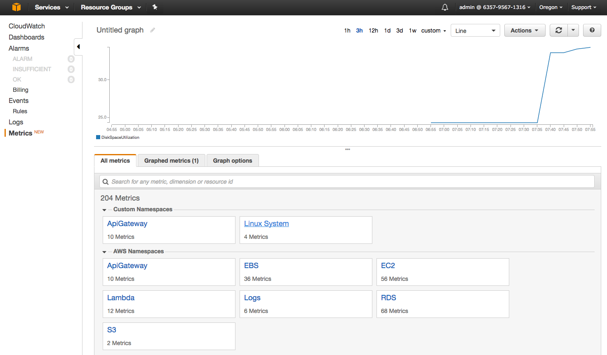

  * TASK2(RESULT)

  Now we have all the logs in the log stream, and we could create metric filters and alarms
  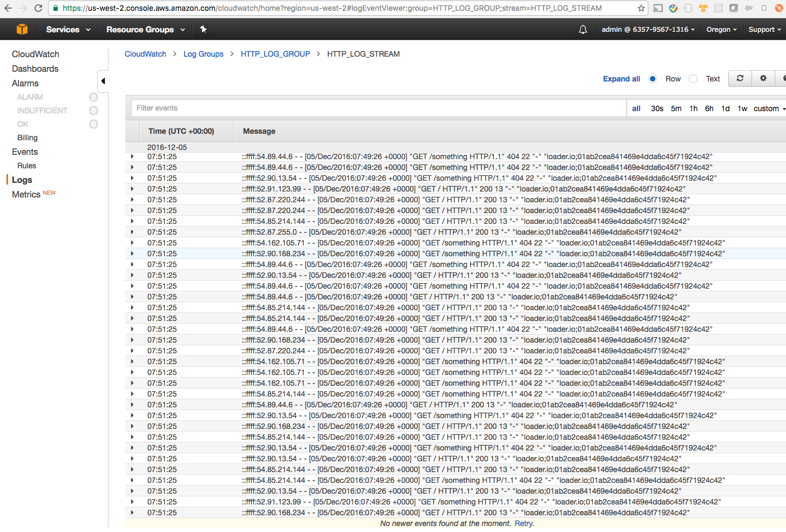
  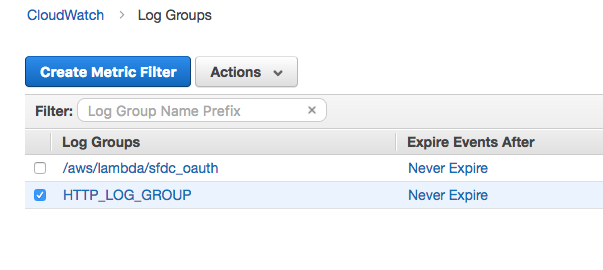
  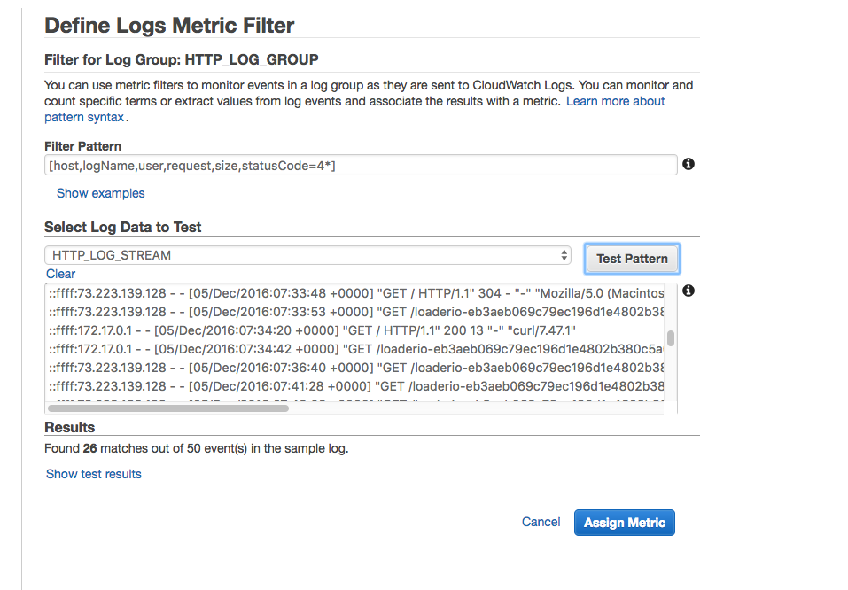
  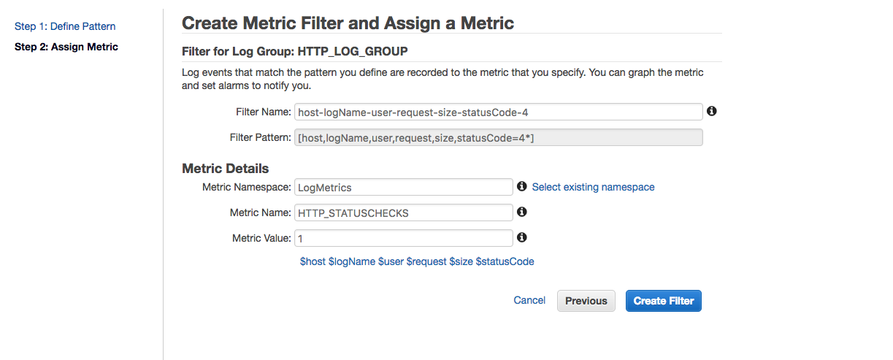

  And you can use the metric to create alarms
  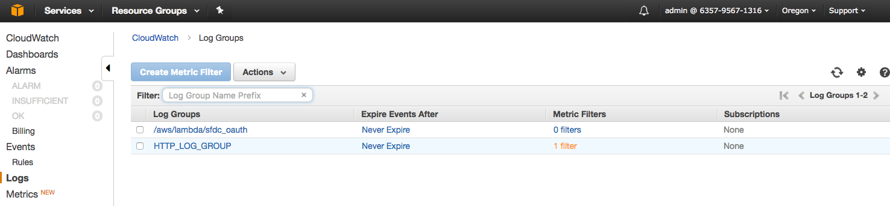
  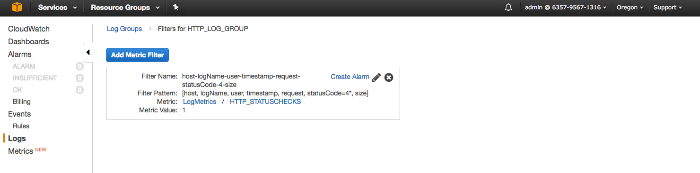
  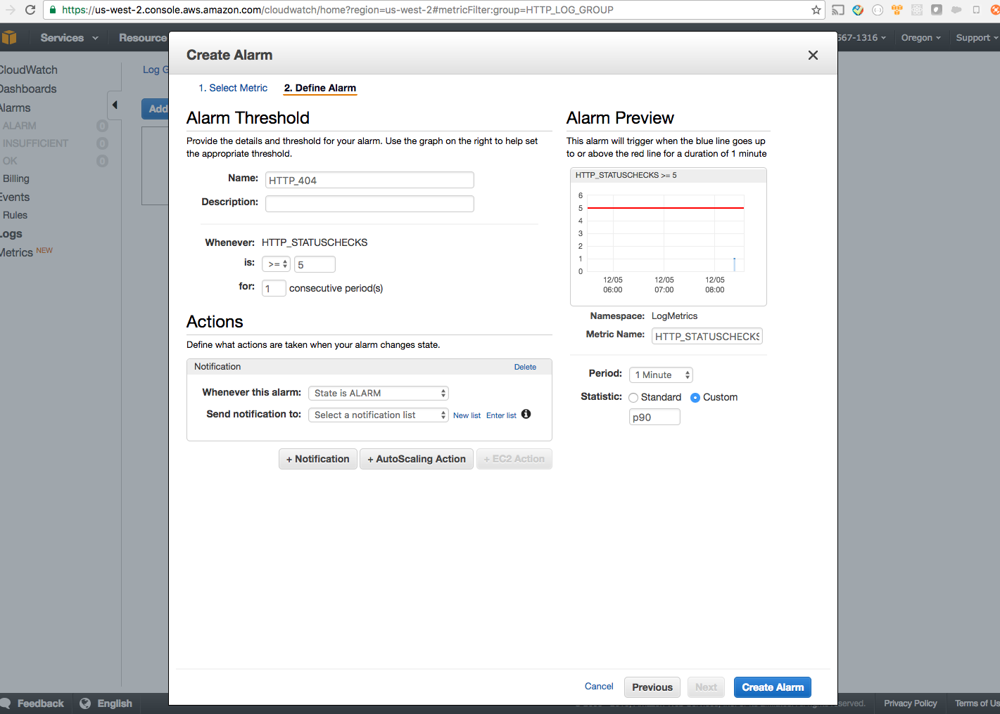
